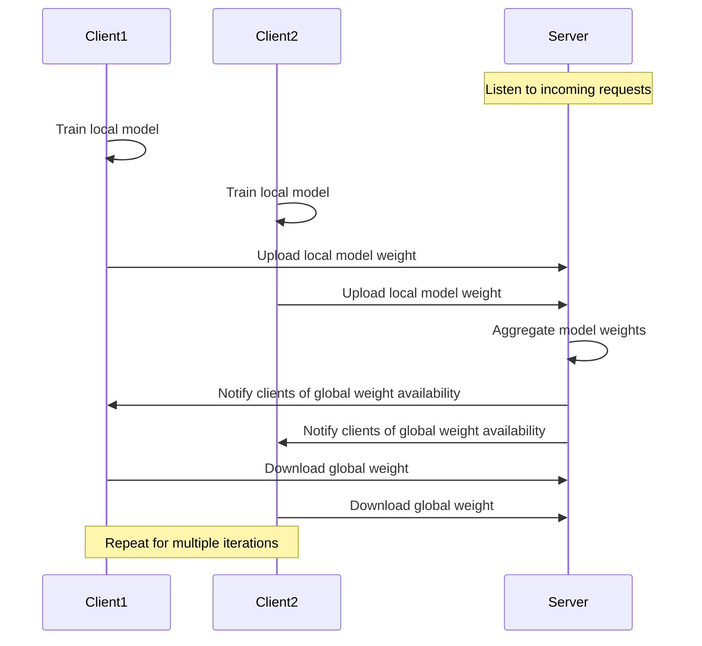

# FedAvg
Running FedAverage algorithm on a single server for federation learning

## Pre-requisites

- `pip install -r requirements.txt`
- Please add your own datasets in the repo.
- Change the absolute path of datasets in `client.py`

## Dataset Prepration

All datasets are under `clients` folder, 
- `client1` is a representative of big company
- `client2` is a representative of iof small company

### Photo Labeling

I simply use **Robeflow** to label the orchid images

> Roboflow Link: https://universe.roboflow.com/kevinliu/orchid_label

### 

## Server
- You should run `app.py` first for running the flask server

## Client

- `python3 client.py`

## Sample Traning Results

# Program Flow

